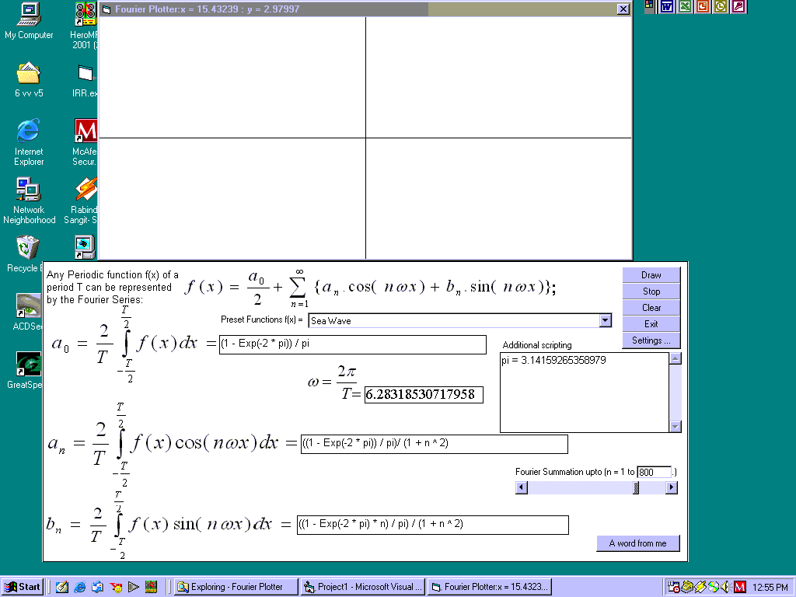



## Fourier Plotter

### Description

This is a program to plot periodic functions using fourier series when the equation of a0, an and bn is given. You can also use VBScript here to specify constants, conditions etc. It can also plot any explicit function of x. It is not only a tool to plot Fourier Series but also to learn about its(Fouries Series) differents properties.
 
### More Info
 
I assume you have primitive knowledge about Fourier Series of Mathematics

The VBScript Help is not added

             |
---                |---
**Submitted On**   |2004-10-27 03:18:02
**By**             |[Iftekhar Tanveer](https://github.com/Planet-Source-Code/PSCIndex/blob/master/ByAuthor/iftekhar-tanveer.md)
**Level**          |Advanced
**User Rating**    |5.0 (10 globes from 2 users)
**Compatibility**  |VB 4\.0 \(32\-bit\), VB 5\.0, VB 6\.0
**Category**       |[Math/ Dates](https://github.com/Planet-Source-Code/PSCIndex/blob/master/ByCategory/math-dates__1-37.md)
**World**          |[Visual Basic](https://github.com/Planet-Source-Code/PSCIndex/blob/master/ByWorld/visual-basic.md)
**Archive File**   |[Fourier\_Pl18108510272004\.zip](https://github.com/Planet-Source-Code/iftekhar-tanveer-fourier-plotter__1-56955/archive/master.zip)

